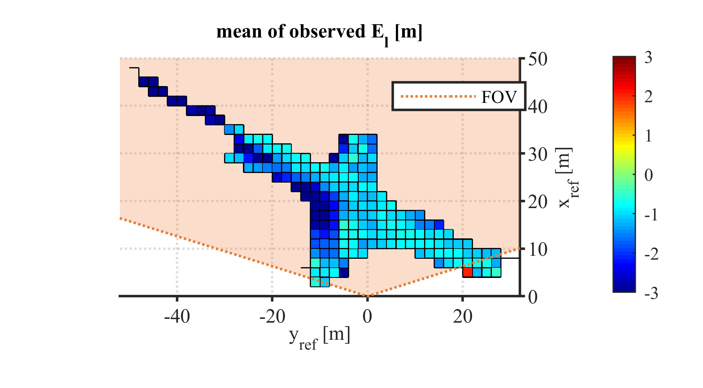
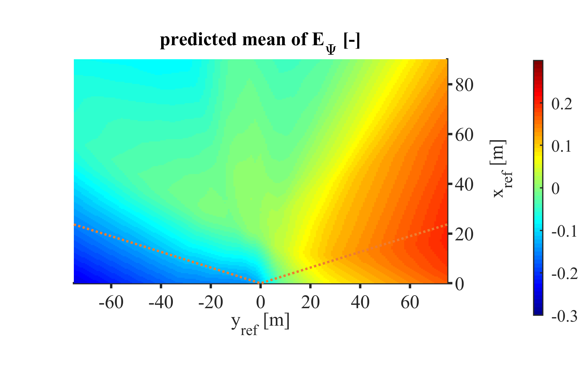

# Using Drones as Reference Sensors for Neural-Networks-Based Modeling of Automotive Perception Errors

This repository holds additional figures to the mentioned [IEEE IV](https://ieee-iv.org/) 2020 publication, which is available at:
- arXiv: Link will be included.
- IEEEXplore: Link will be included.


To cite the following graphics, please cite the paper itself. It includes a link to this repository. Bibtex:
```
@InProceedings{Krajewski2020UsingDrones,
  author    = {Krajewski, Robert and Hoss, Michael and Meister, Adrian and Thomsen, Fabian and Bock, Julian and Eckstein, Lutz},
  booktitle = {2020 IEEE Intelligent Vehicles Symposium (IV)},
  title     = {Using Drones as Reference Sensors for Neural-Networks-Based Modeling of Automotive Perception Errors},
  year      = {2020},
}
```

## Short Background

Vehicles are perceived by both a lidar-based system under test (SUT) and a UAV-based reference measurement system (ref).
For both systems, the vehicle state vector  consists of positions, velocities, width, length, and orientation angle. 
The following graphics show the errors  of the lidar-based objects with respect to the reference. These errors can be
- **observed** in actually measured data
- **predicted** by the neural-networks-based Gaussian error model. The inputs to this model can be:
  - reference data that actually got measured
  - artificially generated reference data.

Please read the paper for more information.


# Figures

## Errors observed and predicted on *measured* reference data

### Position x


### Position y


### Velocity vx


### Velocity vy


### Width


### Length



### Orientation angle


## Errors predicted on *artificial* reference data

### Position x


### Position y


### Velocity vx


### Velocity vy


### Width


### Length


### Orientation angle

